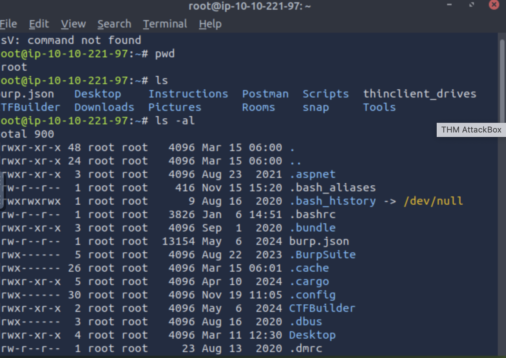
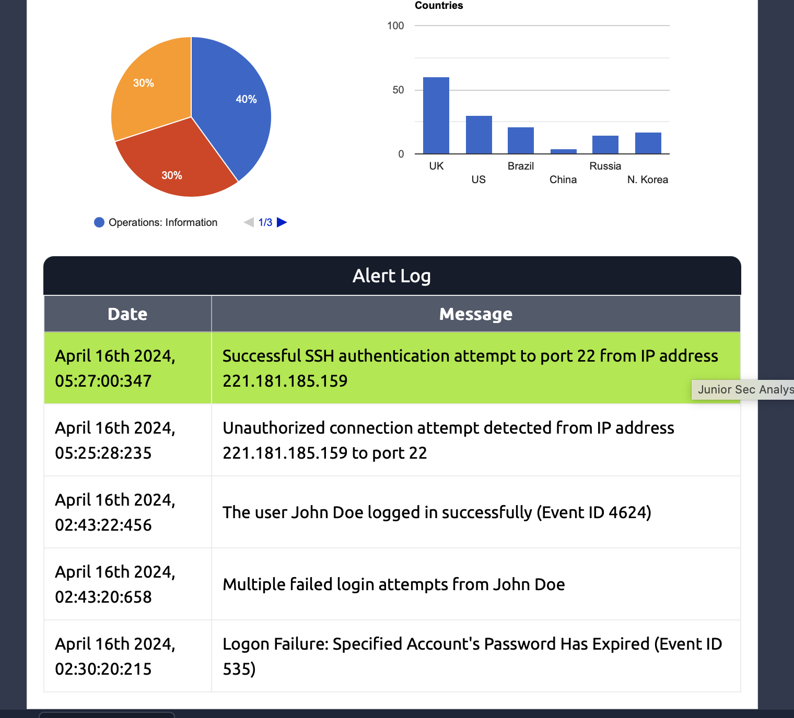
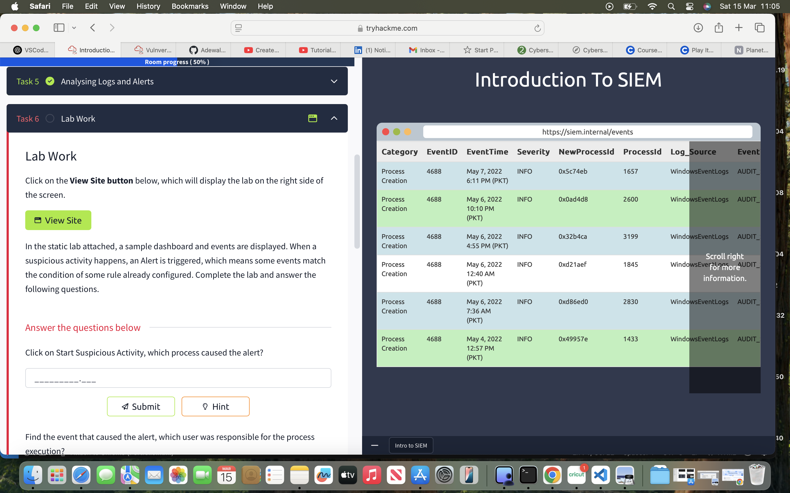
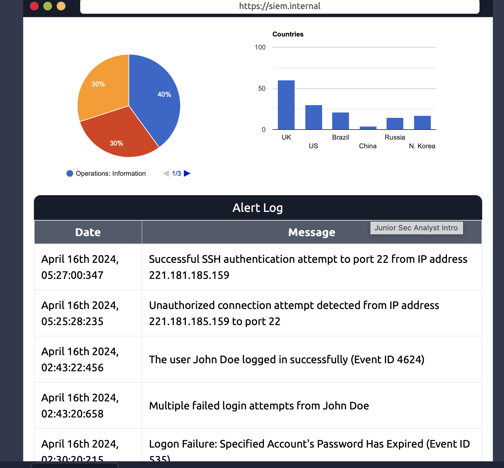
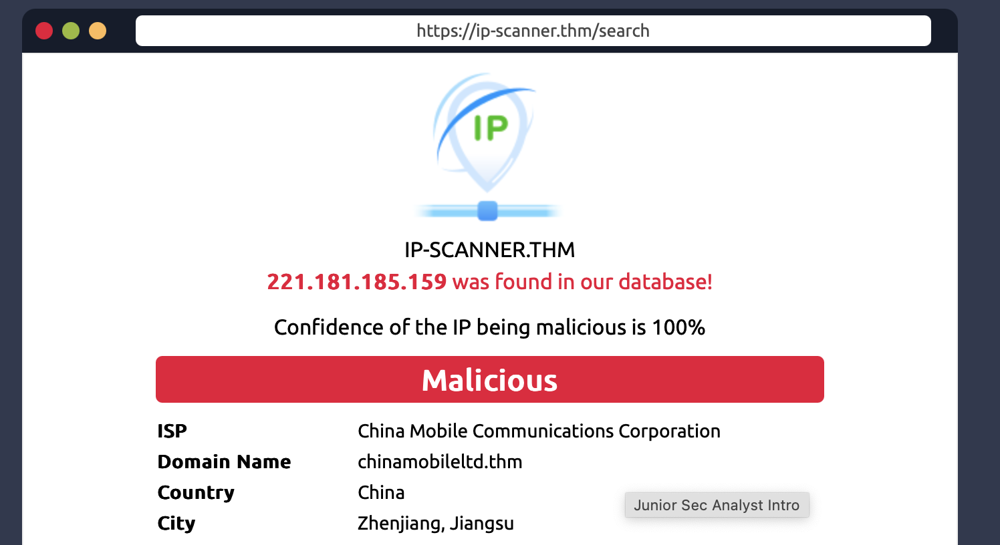
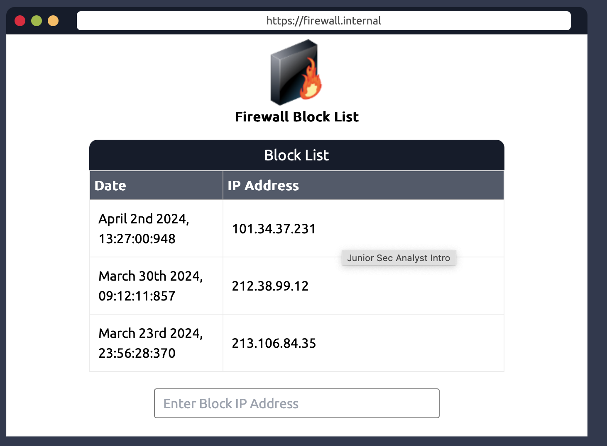

# I'm Adewale
## Cybersecurity Portfolio

🚀 **View my portfolio live:**  
🔗 [Click Here](https://github.com/Planet1Insure)

## About This Portfolio
This portfolio showcases my expertise in **Cybersecurity**, including **penetration testing, SIEM analysis, vulnerability assessments, and security operations**.

I am a passionate Information Technology professional with a growing specialization in Cybersecurity.
My journey began as a certified Oracle Expert and Oracle Certified Associate, where I gained experience in Linux applications and database management using SQL.

To further solidify my technical expertise, I pursued a Master’s degree in Information Technology with a focus on Business Intelligence.
During my studies, I explored Cybersecurity, which became an integral part of my coursework and projects.
I applied cybersecurity principles to fortify web applications and enhance their security.
Some of these projects are included in this portfolio and are currently running.

## 🛠️ Skills Highlighted:
- ç
- **NIST Framework**
- **SQL & Python**
- **Log Analysis using Wireshark, SIEM, and Splunk**
- **Incident Reportingk**
- **Effective communicationk**

## 📸 Experience:
**Linux to check users' privileges**

**Checking the function of a command on Linux**

**SIEM Dashboard and log Analysis**

**Log Analysis**

**Assessing log files for unathorised access on SIEM**

**Identifying malicious ip address before escalatng to the team lead**

**Blocking malicious ip**

## 🔗 Connect with Me:
- **LinkedIn:** [View Profile](https://www.linkedin.com/in/adewalealadeloye/)  
- **GitHub:** [Visit My GitHub](https://github.com/Planet1Insure)

_This portfolio is a work in progress. Stay tuned for updates!_ 🚀
