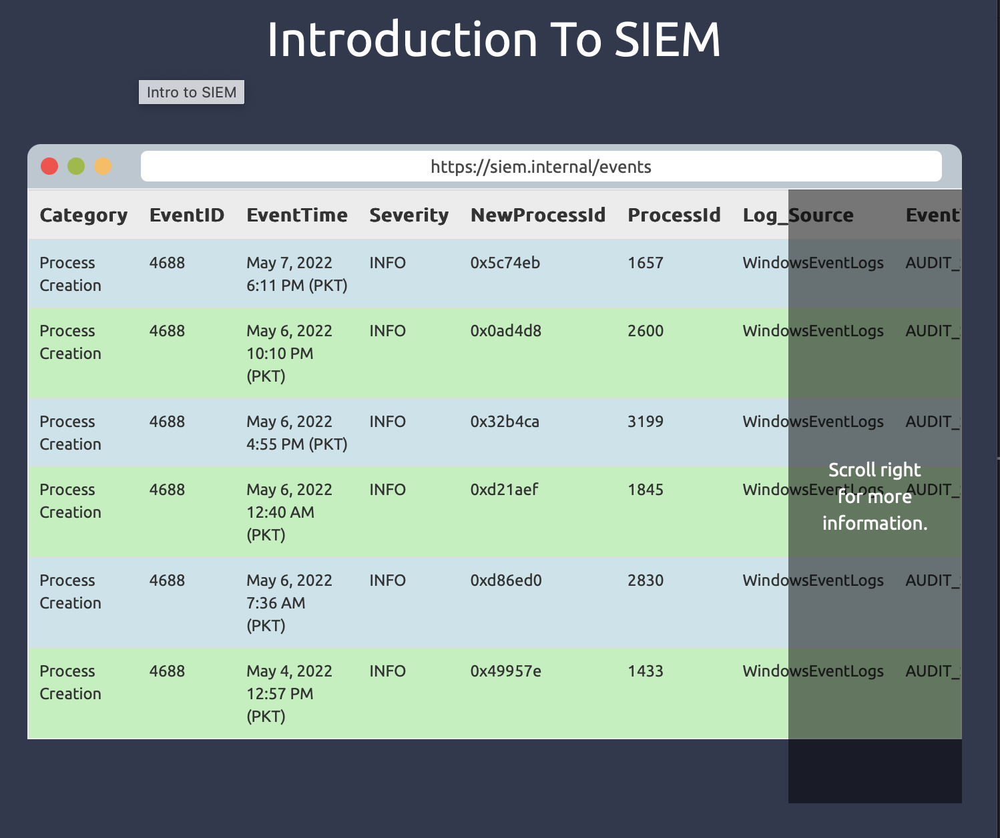

# Cybersecurity Portfolio

🚀 **View my portfolio live:**  
🔗 [Click Here](https://planet1insure.github.io)

## About This Portfolio
This portfolio showcases my expertise in **Cybersecurity**, including **penetration testing, SIEM analysis, vulnerability assessments, and security operations**.

## 🛠️ Skills Highlighted:
- **Linux Administration**
- **NIST Framework**
- **SQL & Python**
- **Log Analysis using Wireshark, SIEM, and Splunk**

## 📸 Screenshots of Work:

## 🔗 Connect with Me:
- **LinkedIn:** [View Profile](https://www.linkedin.com/in/adewalealadeloye/)  
- **GitHub:** [Visit My GitHub](https://github.com/Planet1Insure)

_This portfolio is a work in progress. Stay tuned for updates!_ 🚀
